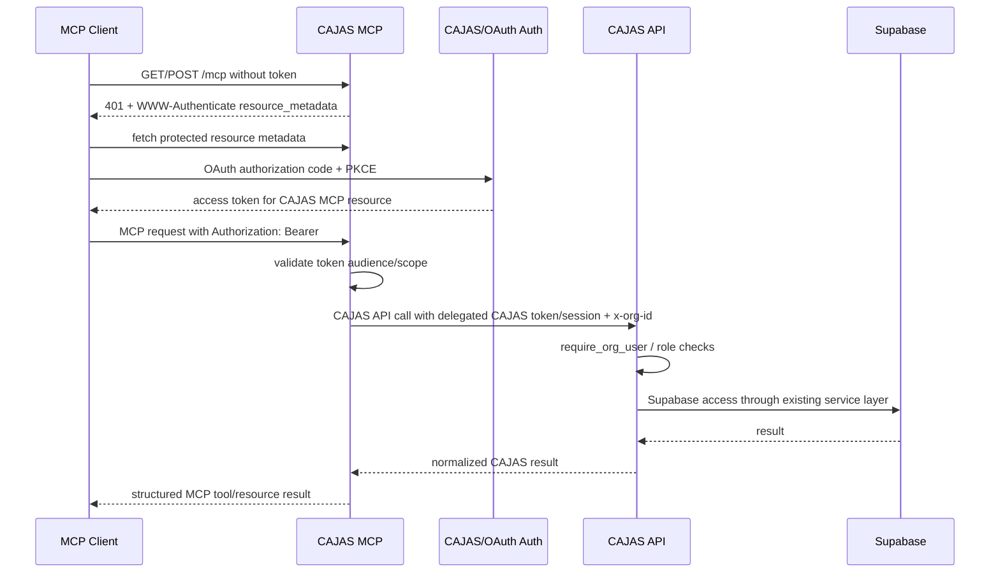
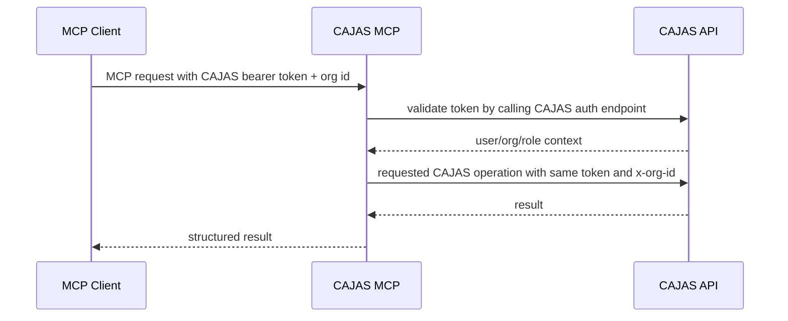

# CAJAS MCP Deployment And Repository Design

## 1. Public Repository

Recommended repository:

```text
SEBIT/cajas-mcp
```

Rationale:

- Lowercase, package-friendly name.
- Clear separation from private CAJAS application repository.
- Public-source scope is only the MCP adapter, not CAJAS backend/domain code.

Alternative:

```text
SEBIT/CAJAS-MCP
```

Acceptable for branding, but less idiomatic for Python package/distribution naming.

## 2. Repository Boundary

Never include:

```text
Supabase service role key
production JWT
CAJAS database credentials
Railway tokens
Stack Exchange secret
private API endpoints requiring internal credentials
customer data
private CAJAS source code
private schema dump
internal production hostname secrets
```

The public repo contains:

- MCP server implementation.
- CAJAS API client interfaces.
- Tool/resource schemas.
- Security policy.
- Tests with mocked CAJAS API responses.
- Docs and examples.

It does not contain CAJAS backend service functions or DB migrations.

## 3. Proposed Repository Structure

```text
cajas-mcp/
├─ src/
│  └─ cajas_mcp/
│      ├─ server.py
│      ├─ app.py
│      ├─ config.py
│      ├─ auth.py
│      ├─ client.py
│      ├─ errors.py
│      ├─ logging.py
│      │
│      ├─ tools/
│      │   ├─ workspace.py
│      │   ├─ coa.py
│      │   ├─ raw.py
│      │   ├─ event.py
│      │   ├─ assembly.py
│      │   └─ standards.py
│      │
│      ├─ resources/
│      │   ├─ capabilities.py
│      │   ├─ workspace.py
│      │   ├─ event_context.py
│      │   └─ profile_context.py
│      │
│      ├─ schemas/
│      │   ├─ common.py
│      │   ├─ errors.py
│      │   ├─ levels.py
│      │   ├─ raw.py
│      │   ├─ coa.py
│      │   ├─ assembly.py
│      │   └─ standards.py
│      │
│      ├─ adapters/
│      │   ├─ files.py
│      │   ├─ tabular.py
│      │   ├─ external_context.py
│      │   └─ stack_exchange.py
│      │
│      └─ security/
│          ├─ policy.py
│          ├─ origin.py
│          ├─ sanitizer.py
│          └─ prompt_injection.py
│
├─ tests/
│  ├─ contract/
│  ├─ unit/
│  ├─ integration/
│  └─ fixtures/
│
├─ examples/
│  ├─ claude-code.json
│  ├─ generic-client.md
│  └─ stdio-dev.md
│
├─ docs/
│  ├─ protocol-contract.md
│  ├─ authentication.md
│  ├─ deployment-railway.md
│  ├─ security-model.md
│  └─ accounting-boundary.md
│
├─ Dockerfile
├─ railway.toml
├─ pyproject.toml
├─ uv.lock
├─ .env.example
├─ .gitignore
├─ LICENSE
├─ SECURITY.md
├─ CONTRIBUTING.md
└─ README.md
```

## 4. CAJAS API Client

`CajasClient` responsibilities:

- Forward or exchange authorization according to configured auth mode.
- Forward workspace context with `x-org-id`.
- Generate and forward `x-request-id`.
- Set timeouts.
- Apply bounded retries for retryable upstream failures.
- Normalize CAJAS API errors into MCP domain error envelope.
- Preserve CAJAS backend as authorization source of truth.
- Track CAJAS API compatibility version.
- Avoid direct knowledge of Supabase schema except stable API DTO names.

Initial client methods:

```python
class CajasClient:
    async def list_workspaces(...)
    async def list_profiles(...)
    async def get_coa(...)
    async def search_raw_entries(...)
    async def search_events(...)
    async def get_event(...)
    async def get_judgment_context(...)
    async def preview_raw_import(...)
    async def execute_raw_import(...)
    async def preview_coa_import(...)
    async def execute_coa_import(...)
    async def list_standards(...)
    async def list_interpretations(...)
    async def get_close_status(...)
```

## 5. Authentication Sequence

Recommended production sequence:



Beta bearer-forwarding sequence:



The beta path is operationally simple but not the long-term production target because current MCP auth guidance forbids unsafe token passthrough across resource audiences.

## 6. Railway Architecture

Recommended deployment:

```text
GPT / Claude / Codex / MCP clients
             ↓
       https://sebit-mcp.com/mcp
             ↓
       Railway CAJAS MCP Service
             ↓
       CAJAS Production API
             ↓
            Supabase
```

### Separate Service vs Same Service

| Option | Pros | Cons | Recommendation |
|---|---|---|---|
| Same Railway service as CAJAS FastAPI | No extra network hop, easier local imports | Public repo separation difficult, scaling coupled, blast radius larger | not preferred |
| Separate Railway MCP service | Isolation, public repo clean, independent scaling/deploy, smaller secret surface | Needs API auth/client and network calls | preferred |

Use a separate Railway service.

## 7. Railway Runtime Plan

Runtime:

```text
Python 3.12+
ASGI
uvicorn
official mcp Python SDK
Streamable HTTP mounted at /mcp
```

Bind:

```text
0.0.0.0:$PORT
```

Start command:

```text
uvicorn cajas_mcp.app:app --host 0.0.0.0 --port ${PORT:-8000}
```

Healthcheck:

```text
GET /health
```

Readiness:

```text
GET /ready
```

Graceful shutdown:

- Use ASGI lifespan.
- Close HTTP client pools.
- Flush logs.
- Stop MCP session manager.

Timeouts:

- CAJAS API connect timeout: 5s.
- CAJAS API read timeout: 30s for normal tools.
- File preview/import read timeout: 120s.
- External provider timeout: 10s.
- MCP stream read may remain open according to SDK/client transport behavior.

Concurrency:

- Start with one Railway service, one process.
- Use async I/O for CAJAS API and external provider calls.
- Limit concurrent file parses/import previews with semaphore.
- Keep CPU-heavy XLSX parsing bounded.

Autoscaling:

- Scale horizontally by request volume.
- Do not store required session state in process memory.
- Preview IDs should be deterministic hashes or persisted through CAJAS API if later needed.

## 8. Dockerfile Plan

```dockerfile
FROM python:3.12-slim

ENV PYTHONDONTWRITEBYTECODE=1
ENV PYTHONUNBUFFERED=1

WORKDIR /app

COPY pyproject.toml uv.lock ./
RUN pip install --no-cache-dir uv && uv sync --frozen --no-dev

COPY src ./src

ENV PATH="/app/.venv/bin:$PATH"

CMD ["sh", "-c", "uvicorn cajas_mcp.app:app --host 0.0.0.0 --port ${PORT:-8000}"]
```

Use a non-root user in implementation before production release.

## 9. `railway.toml` Plan

```toml
[build]
builder = "DOCKERFILE"
dockerfilePath = "Dockerfile"

[deploy]
startCommand = "uvicorn cajas_mcp.app:app --host 0.0.0.0 --port ${PORT:-8000}"
healthcheckPath = "/health"
healthcheckTimeout = 30
restartPolicyType = "ON_FAILURE"
restartPolicyMaxRetries = 3
```

## 10. Environment Variables

`.env.example` should contain names only:

```text
CAJAS_API_BASE_URL=
CAJAS_MCP_PUBLIC_URL=https://sebit-mcp.com
CAJAS_API_COMPATIBILITY_VERSION=

AUTH_MODE=oauth
OAUTH_ISSUER_URL=
OAUTH_AUDIENCE=
OAUTH_REQUIRED_SCOPES=

STACKEXCHANGE_KEY=
STACKEXCHANGE_SITE_WHITELIST=stackoverflow,serverfault,superuser

MCP_TRANSPORT=streamable-http
MCP_PATH=/mcp
LOG_LEVEL=info
ALLOWED_ORIGINS=

MAX_FILE_BYTES=10485760
MAX_ROWS=10000
MAX_COLUMNS=200
MAX_SHEETS=10

REQUEST_TIMEOUT_SECONDS=30
EXTERNAL_TIMEOUT_SECONDS=10
```

Railway stores real values. GitHub must not contain secrets.

## 11. Domain Options

### Option A: `https://sebit-mcp.com/mcp`

Pros:

- Matches MCP convention.
- Leaves root for docs/status.
- Simple custom domain.

Cons:

- If multiple MCP products later share one domain, path routing must be planned.

Recommendation: best current default.

### Option B: `https://mcp.sebit-mcp.com/`

Pros:

- Clean host dedicated to MCP.
- Easier future gateway at apex.

Cons:

- More DNS/certificate setup.
- Root endpoint is less conventional than `/mcp` unless still using `/mcp`.

Good later option:

```text
https://mcp.sebit-mcp.com/cajas
```

### Option C: `https://sebit-mcp.com/`

Pros:

- Short.

Cons:

- Less explicit.
- Harder to host `/health`, docs, multiple MCP services.

Not preferred.

Recommended now:

```text
https://sebit-mcp.com/mcp
```

Future gateway if needed:

```text
https://sebit-mcp.com/cajas/mcp
https://sebit-mcp.com/calculation/mcp
```

Do not build this gateway in Phase 0.

## 12. Versioning

Versions:

```text
MCP server version: semantic version, e.g. 0.1.0
MCP protocol version: negotiated, e.g. 2025-11-25
CAJAS API compatibility version: explicit config/check
Tool schema version: per-tool metadata
```

Avoid `v1_` in tool names. Keep names stable:

```text
cajas.preview_raw_import
```

Use backward-compatible schema changes:

- Add optional fields.
- Do not remove required fields without major version.
- Do not change enum meanings.
- Keep deprecated fields for at least one minor release.

Expose version metadata:

```json
{
  "server_version": "0.1.0",
  "protocol_version": "2025-11-25",
  "cajas_api_compatibility": "2026-08",
  "tool_schema_versions": {
    "cajas.preview_raw_import": "1.0.0"
  }
}
```

## 13. Observability

Minimum:

- JSON logs.
- request id.
- MCP session id hash.
- tool name.
- duration.
- status.
- org id.
- user id hash.
- CAJAS API status.
- external provider latency.

Sensitive data is redacted by default.

## 14. License

MIT:

- Very permissive.
- Short and familiar.
- No explicit patent grant.

Apache-2.0:

- Permissive.
- Explicit patent grant.
- Better for corporate adoption and contributors.
- Slightly longer.

Recommendation: Apache-2.0 for the public MCP adapter.

Scope statement:

```text
This license applies only to the CAJAS MCP adapter source code in this repository.
It does not apply to the proprietary CAJAS application, CAJAS backend, CAJAS data,
customer data, or private deployment configuration.
```

